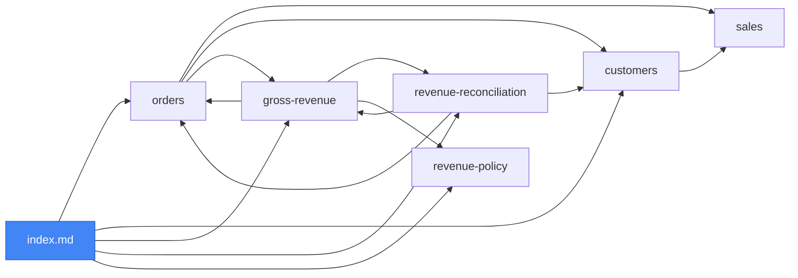

<div align="center">

# 🧠 okf-knowledge

### Turn scattered docs into a knowledge graph your AI agents can actually use

**A portable [Claude Code](https://docs.claude.com/en/docs/claude-code) skill (`/okf`) to create, read, maintain, and visualize [Open Knowledge Format](https://github.com/GoogleCloudPlatform/knowledge-catalog/tree/main/okf) bundles — knowledge as plain, git‑versionable Markdown. No SDK. No database. No lock‑in.**

[](https://github.com/GoogleCloudPlatform/knowledge-catalog/blob/main/okf/SPEC.md)
[](https://www.python.org/)
[](https://docs.claude.com/en/docs/claude-code)
[](LICENSE)
[](#-contributing)
[](okf/scripts/tests)
[](#-license)

</div>

---

> ⚠️ **Disclaimer — this is vibe‑coded.** Built fast, for fun, by one person with an AI pair‑programmer. It's tested and it works, but it's an **unofficial indie project** (not affiliated with Google or Anthropic), shipped **as‑is with zero guarantees** — use at your own risk. Spot a bug? Issues and PRs welcome. 🌊

> **TL;DR** — Knowledge ends up trapped in wikis, Notion, 3,000‑line READMEs, and people's heads — where AI agents can't use it well. **OKF** represents knowledge as a directory of small Markdown files: each file is *one concept* (a table, an endpoint, a metric, a runbook…), with a tiny YAML header, linked to other concepts like wiki pages. The result is a **navigable knowledge graph** that agents read natively, that you version in git, and that no vendor owns. This repo is a `/okf` command that builds and maintains those bundles for you.

```yaml
---
type: BigQuery Table          # the only required field
title: Orders
description: One row per completed customer order.
resource: bigquery://acme/sales/orders
tags: [sales, orders]
timestamp: 2026-05-28
---

# Orders

Part of the [sales dataset](/datasets/sales.md). Feeds [gross revenue](/metrics/gross-revenue.md).
```

---

## 🤔 The problem OKF solves

Your organization's knowledge is **real but unusable by machines**:

- 📚 **Scattered** across Confluence, Notion, Google Docs, READMEs, Slack threads, and people's memory.
- 🔒 **Locked in** proprietary tools that need accounts, APIs, and scraping to read.
- 🧱 **Monolithic** — the one big doc that's either loaded whole (expensive, slow) or ignored.
- 🪦 **Rotting** — nobody edits a 3,000‑line doc, so it silently drifts from reality.
- 🤖 **Hostile to agents** — an LLM either drowns in irrelevant context or hallucinates the gap.

AI agents are great at reading **Markdown** and **following links**. So the fix isn't another platform — it's a *format*: small, linked Markdown files an agent can traverse, a human can read, and git can version.

That format is **OKF** (Open Knowledge Format), a vendor‑neutral spec from Google Cloud. This repo makes an agent fluent in it.

---

## ✨ Why it works

| | |
|---|---|
| 🧩 **One file = one concept** | A table, endpoint, metric, runbook, decision, service… — atomic and individually linkable. |
| 🔗 **Links *are* the graph** | Concepts reference each other with ordinary Markdown links. Relationships are explicit, not inferred. |
| 🔦 **Progressive disclosure** | Agents start at `index.md` and follow *only* the relevant links — they read 3 small files, not 3,000 lines. |
| 🏷️ **Frontmatter = query layer** | Filter by `type` / `tags` without opening a single body. |
| 🌿 **Git‑native** | Diff it, review it, branch it, PR it. Your knowledge gets the same workflow as your code. |
| 📦 **Zero lock‑in** | No schema registry, no SDK, no runtime, no database. Just UTF‑8 text that outlives every tool. |
| 🌐 **A standard, not a silo** | One bundle feeds your coding agent, a docs site, a search tool, onboarding — anything OKF‑aware. |

---

## 🆚 How OKF compares

| | Wiki / Notion / Confluence | Vector DB / RAG | One big README | **OKF bundle** |
|---|:---:|:---:|:---:|:---:|
| Agent‑readable | ⚠️ via API/scrape | ✅ (lossy chunks) | ✅ (all‑or‑nothing) | ✅ native MD + links |
| Keeps relationships | ⚠️ human links | ❌ chunks lose them | ⚠️ implicit | ✅ explicit graph |
| Progressive disclosure | ❌ | ⚠️ top‑k only | ❌ load it all | ✅ index → links |
| Git diff / review / PR | ❌ | ❌ | ✅ | ✅ |
| Infra to run | SaaS account | embeddings + DB + pipeline | none | **none** |
| Vendor lock‑in | high | medium | none | **none (spec)** |
| Human‑readable | ✅ | ❌ | ✅ | ✅ |

> **OKF doesn't replace RAG — it feeds it.** A curated OKF bundle is a great, structured corpus to embed: you keep an inspectable, versioned source of truth, and let retrieval sit on top.

---

## 🚀 Quick start

```bash
# 1. Get it
git clone https://github.com/sniperunder123/okf-knowledge.git
cd okf-knowledge

# 2. One dependency (for the validator)
pip install -r requirements.txt

# 3. Install the skill — /okf works immediately, in every project
cp -r okf ~/.claude/skills/                              # macOS / Linux
# Windows (PowerShell): Copy-Item -Recurse okf "$env:USERPROFILE\.claude\skills\"

# 4. Try it
python okf/scripts/validate.py okf/resources/example-bundle --strict
# → 8 file(s), 0 error(s), 0 lint(s)
```

The skill is named `okf`, so the command is **`/okf`** out of the box — no alias, no config (just like `/graphify`).

---

## 🎛️ Usage — the `/okf` command

okf-knowledge is **command‑driven** — run it whenever you want a bundle built or brought back in sync:

```
/okf                      # smart default: sync the okf/ bundle if it exists, else init one
/okf init [path]          # build a new bundle from this project's code + docs
/okf update [path]        # sync the bundle with what changed; fix links, append log.md, validate
/okf query "<question>"   # answer by navigating the bundle, index-first (no full-file dumps)
/okf validate [path]      # run conformance + lint checks
/okf viz [path]           # (re)generate viz.html + graph.mmd
/okf add "<thing>"        # add one concept and wire its links
```

> **Keep docs in sync while you build.** Add to your project's `CLAUDE.md`: *“After any change to code or docs, run `/okf update`.”* Your agent then refreshes the bundle as part of every task, and `validate.py` keeps it honest in CI.

---

## 📦 What's an OKF bundle?

A **bundle** is a directory tree of Markdown files. Each non‑reserved file is **one concept** with a YAML frontmatter block whose only required field is `type`. Two filenames are reserved at every level: `index.md` (navigation) and `log.md` (change history).

```
example-bundle/
├── index.md                      # the map — start here (declares okf_version)
├── log.md                        # chronological change history
├── datasets/
│   └── sales.md                  # type: BigQuery Dataset
├── tables/
│   ├── orders.md                 # type: BigQuery Table
│   └── customers.md              # type: BigQuery Table
├── metrics/
│   └── gross-revenue.md          # type: Metric  (+ # Citations)
├── playbooks/
│   └── revenue-reconciliation.md # type: Playbook
└── references/
    └── revenue-policy.md         # type: Reference
```

…and the links between those concepts form a graph (`/okf viz` renders this interactively):



> 🐶 **We dogfood.** This repo describes *itself* as an OKF bundle at [`okf/resources/self-bundle/`](okf/resources/self-bundle/) — the `/okf` command, the validator, the rules, and the design decisions, all as linked concepts. Run `/okf viz okf/resources/self-bundle` to explore the graph.

### Frontmatter fields

| Field | Required | Meaning |
|---|:---:|---|
| `type` | ✅ | A short string: what kind of concept this is (free‑form, not registered centrally). |
| `title` | — | Human‑readable name (else derived from the filename). |
| `description` | — | One sentence — the quick‑query summary. |
| `resource` | — | A URI identifying the underlying asset (a table, an endpoint…). |
| `tags` | — | A YAML list for cross‑cutting filtering. |
| `timestamp` | — | ISO‑8601 of the last meaningful change (a date like `2026-05-28` is fine). |

---

## 🧠 How an agent actually uses a bundle

The whole point is **cheaper, sharper** agent reasoning. Ask *“how is gross revenue computed and what do I watch at month‑end?”*

```
1. read  index.md                        (~300 tokens)  → find the relevant concepts
2. read  metrics/gross-revenue.md        (~500 tokens)  → the definition + SQL
3. follow → tables/orders.md             (~500 tokens)  → the source columns
4. follow → playbooks/revenue-reconciliation.md (~400 tokens) → the caveats
→ answer.
```

Versus dumping a monolithic doc into context on **every** question. On a real migration we ran, a **2,762‑line doc (~40k tokens)** became **83 linked concepts** — and a typical question now touches **~3 small files (~1.5k tokens)**. That's the difference between paying for the whole library every time and walking straight to the right shelf: **less context, lower cost, fewer hallucinations.**

---

## 🧩 Concept types cheat‑sheet

`type` is free‑form — pick descriptive values. Common ones:

| Domain | Example `type` values |
|---|---|
| Data | `BigQuery Table`, `Dataset`, `MongoDB Collection`, `Metric`, `Dashboard` |
| Services / code | `Service`, `Module`, `API Endpoint`, `Library`, `Config` |
| Ops | `Runbook`, `Playbook`, `Incident`, `SLA`, `Alert` |
| Org / context | `Decision`, `Policy`, `Glossary Term`, `Reference`, `Overview` |

Consumers **must tolerate unknown types** — so you can invent what fits your domain.

---

## ✅ The validator

`okf/scripts/validate.py` enforces the **three hard OKF v0.1 conformance rules** and, with `--strict`, runs **producer lints** on your graph.

```bash
python okf/scripts/validate.py <bundle>            # conformance only (CI gate)
python okf/scripts/validate.py <bundle> --strict   # + producer lint warnings
```

| Check | Kind | Default | `--strict` |
|---|:---:|:---:|:---:|
| Parseable YAML frontmatter on every concept | **error** | ✅ | ✅ |
| Non‑empty string `type` | **error** | ✅ | ✅ |
| Reserved‑file structure (`index.md` / `log.md`) | **error** | ✅ | ✅ |
| Missing recommended fields (`title`, `description`) | lint | | ⚠️ |
| Broken intra‑bundle links | lint | | ⚠️ |
| Links missing the `.md` extension | lint | | ⚠️ |
| Orphan concepts (unreachable from any index) | lint | | ⚠️ |

**Conformance errors** are spec violations — a bundle that fails any of the three is not a valid OKF bundle. **Producer lints** (warnings) flag quality issues in the tool generating the bundle; they are *not* spec violations and consumers **must tolerate** bundles that have them.

Exit codes: **`0`** conformant · **`1`** errors (or warnings under `--strict`) · **`2`** bad invocation / PyYAML missing.

> 🔎 **Why a real YAML parser?** It uses **PyYAML** so its verdict matches every other OKF consumer's. It refuses to guess: if PyYAML is missing it exits with a clear message instead of silently passing a malformed bundle.

> 🧱 **One parser, tested.** `validate.py` and `visualize.py` share a single `okf_common.py` module (PyYAML parsing + code‑aware link extraction that ignores links inside code blocks), so the graph the visualizer draws matches exactly what the validator checks. A **`pytest` suite** in [`okf/scripts/tests/`](okf/scripts/tests) covers the rules and guards against regressions — run `pytest`.

---

## 🗺️ When to use OKF — and when not

**Great fit**
- A large, sprawling system whose knowledge lives in one giant doc (or nowhere).
- AI‑heavy development where agents need to *understand* the system cheaply.
- Knowledge you want versioned, reviewed, and portable across tools.
- Cross‑cutting links: a metric → its table → its endpoint → its runbook.

**Probably overkill**
- A tiny project a strong model fully reads in one shot.
- A pure code question where the **code itself** is the source of truth (OKF shines for the *why*, the cross‑cutting, the tribal knowledge — not for restating a function).
- Knowledge nobody will maintain — a stale bundle is worse than none. Pair it with `/okf update` + a CI `validate` gate.

Being honest beats hype: OKF is leverage when knowledge is **big, linked, and agent‑consumed**; it's ceremony when it isn't.

---

## 📁 What's in the repo

```
okf-knowledge/
├── README.md · LICENSE · requirements.txt
└── okf/                          # ← the skill (copy this folder into ~/.claude/skills/)
    ├── SKILL.md                  # the /okf operating manual
    ├── scripts/
    │   ├── validate.py           # conformance + producer-lint checker
    │   ├── visualize.py          # self-contained graph → viz.html + graph.mmd
    │   ├── okf_common.py         # shared parser + link extraction (used by both)
    │   └── tests/                # pytest suite (run `pytest`)
    └── resources/
        ├── example-bundle/       # a minimal reference bundle
        └── self-bundle/          # this project, documented in its own format (dogfood)
```

---

## 🛠 Requirements

- **Python 3.7+** and **PyYAML** (`pip install pyyaml`) — required by both `validate.py` and `visualize.py`.
- That's the entire footprint. The skill content (`SKILL.md`, the example bundle) is just Markdown — it needs nothing.

---

## ❓ FAQ

<details>
<summary><b>What problem does OKF actually solve?</b></summary>

It turns knowledge that's scattered, proprietary, or buried in monoliths into **small, linked Markdown files an AI agent can traverse efficiently** — and that you version in git. You stop paying (in tokens and accuracy) to shove whole documents into context, and you stop losing knowledge to tool lock‑in and doc rot.
</details>

<details>
<summary><b>How is this different from a wiki / Notion / Confluence?</b></summary>

Those are built for **humans** and live behind a proprietary product (account, API, export friction). OKF is built for **humans *and* agents**: plain files, explicit links, no platform, fully git‑versionable. You can host an OKF bundle anywhere — or nowhere but your repo.
</details>

<details>
<summary><b>Does OKF replace RAG / a vector database?</b></summary>

No — it **complements** it. RAG chunks text and retrieves by similarity, which loses structure and relationships. OKF keeps an **explicit, inspectable, versioned graph**. The sweet spot: curate knowledge as an OKF bundle, then embed it for retrieval. You get both a trustworthy source of truth *and* fast lookup.
</details>

<details>
<summary><b>How is OKF different from OpenAPI / JSON Schema / dbt docs?</b></summary>

Those describe **one domain** (APIs, schemas, data models). OKF is **domain‑agnostic** and links *across* them: a `Metric` → the `BigQuery Table` it reads → the `API Endpoint` that exposes it → the `Runbook` for when it breaks. OKF concepts can even reference those specs via `resource` instead of duplicating them.
</details>

<details>
<summary><b>Why Markdown, and not JSON / a database?</b></summary>

Because the primary consumers — AI agents and humans — both read Markdown natively, and git diffs it beautifully. The small YAML frontmatter gives just enough structure to query without turning knowledge into a brittle schema. No runtime means it survives every tool migration.
</details>

<details>
<summary><b>One concept per file — isn't that a lot of files?</b></summary>

That's the feature. Small files = precise links, clean diffs, and **progressive disclosure** (an agent reads only what it needs). `index.md` files at each level keep it navigable, and `/okf viz` shows the whole graph. Hundreds of small files beat one unreadable monolith.
</details>

<details>
<summary><b>How does it save tokens / money?</b></summary>

Instead of loading a whole document on every question, an agent reads `index.md` then follows a couple of links — often **~90%+ less context per question** on a large knowledge base. Less context also means fewer distractions and fewer hallucinations.
</details>

<details>
<summary><b>How do I keep the bundle in sync with my code?</b></summary>

Run **`/okf update`** after changes — it detects what moved, fixes links, appends a `log.md` entry, and validates. For enforcement, add `validate.py --strict` to a pre‑commit hook or CI so a broken/stale bundle can't merge. (Anything derivable from code — endpoints, schemas — can also be regenerated programmatically.)
</details>

<details>
<summary><b>What's the difference between this repo and OKF itself?</b></summary>

**OKF** is the open spec (Google Cloud, v0.1, Apache‑2.0). **okf‑knowledge** is independent tooling: a Claude Code skill (`/okf`) plus a `validate.py` conformance checker and a `visualize.py` grapher. You can use the format without this repo, and this repo without Google.
</details>

<details>
<summary><b>Do I have to use Claude Code?</b></summary>

No. A bundle is just Markdown — any agent or human can read it, and `validate.py` / `visualize.py` are plain Python. Claude Code is what gives you the convenient `/okf` workflow; the knowledge itself is portable.
</details>

<details>
<summary><b>Searching for "OKF" finds something called OKF-SCIS — is that the same thing?</b></summary>

No. "OKF" is unfortunately overloaded. **This project uses OKF = Open Knowledge Format** (Google Cloud, v0.1). "OKF-SCIS" (and the older "Open Knowledge Foundation") are unrelated organizations/projects that happen to share the acronym. If a web search for OKF brings up unexpected results, add "Open Knowledge Format" or "Google Cloud" to narrow it down.
</details>

<details>
<summary><b>What can a <code>type</code> be?</b></summary>

Anything descriptive — see the cheat‑sheet above. Types aren't registered centrally, and consumers must tolerate unknown ones, so you model your own domain. Keep them consistent (e.g. Title Case) for easy filtering.
</details>

<details>
<summary><b>What are <code>index.md</code> and <code>log.md</code>?</b></summary>

Reserved files at every directory level. `index.md` is the **map** (progressive disclosure — the agent's entry point); only the bundle‑root one may carry frontmatter, and only `okf_version`. `log.md` is the **history**, newest‑first, with bold convention words (`Creation`, `Update`, `Removal`…). Neither is a concept, so neither has a `type`.
</details>

<details>
<summary><b>Why absolute links that keep the <code>.md</code> (e.g. <code>/tables/orders.md</code>)?</b></summary>

Absolute, bundle‑relative links resolve from the bundle root in any OKF‑aware consumer regardless of where the linking file lives — robust under moves. Keeping `.md` is the spec's convention. (Relative links are allowed too.)
</details>

<details>
<summary><b>Does it scale to thousands of concepts?</b></summary>

Yes — that's where it pays off most. Nest directories, give each its own `index.md`, and even scope a `log.md` per subtree. Agents still only traverse the slice they need, and the validator + viz keep the whole thing honest.
</details>

<details>
<summary><b>Is OKF production‑ready?</b></summary>

The **spec is v0.1 and young**, but the format itself is trivially simple and low‑risk: it's just Markdown files you own in git. There's no runtime to break and nothing to migrate off if it evolves. Start with a bundle for one system; grow from there.
</details>

<details>
<summary><b>What about security / privacy?</b></summary>

A bundle is text in *your* repository. The tooling here makes **no network calls** and stores nothing externally — `validate.py` is pure Python, and `viz.html` is fully self-contained (all JS/CSS is bundled inline; no CDN or external resources are fetched at open time). You control exactly what knowledge goes in. Treat it like any source file: don't commit secrets.
</details>

---

## 🗓 Roadmap / not yet

Things that are planned but not yet implemented — contributions welcome:

- **Pluggable source connectors for `/okf init`** — bulk generation from a source of truth (e.g. BigQuery schema, dbt manifest, OpenAPI spec) without manual LLM-driven inventory. The spec supports it; the skill doesn't automate it yet.
- **Anti-regression lint for `/okf update`** — detect when an `/okf update` run silently drops concepts or breaks links that were clean before, and surface them as lint errors rather than letting the bundle silently regress.

---

## 🤝 Contributing

PRs and issues welcome! Good first contributions: more example bundles (an API or service catalog), additional `type` recipes, or new validator lints. Before opening a PR, run the validator on the example bundle and the test suite:

```bash
python okf/scripts/validate.py okf/resources/example-bundle --strict
pytest
```

---

## 📄 License

[MIT](LICENSE) © okf-knowledge contributors.

**Provided as‑is, with no warranty of any kind** (see [LICENSE](LICENSE)). This is an unofficial, vibe‑coded community project — **not affiliated with, endorsed by, or supported by Google or Anthropic**. Use at your own risk.

Open Knowledge Format itself is published by Google Cloud under Apache‑2.0 — see the [official spec](https://github.com/GoogleCloudPlatform/knowledge-catalog/blob/main/okf/SPEC.md).

<div align="center">

---

If this helped you make sense of OKF, consider leaving a ⭐ — it helps others find it.

</div>
